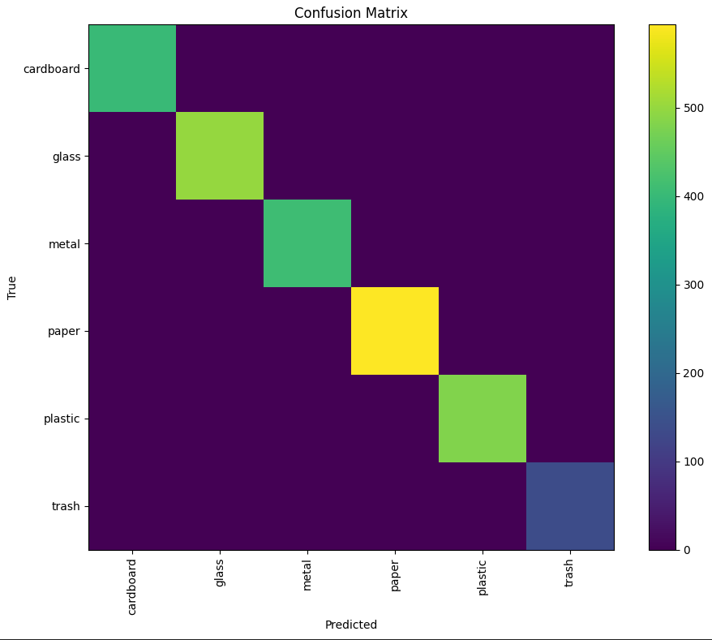

# Waste Sorting Assistant

An intelligent waste classification system powered by deep learning. This project demonstrates the practical application of **Convolutional Neural Networks (CNNs)** for environmental sustainability by automatically categorizing waste items into recyclable and non-recyclable categories.


## Demo

<!-- Add your demo screenshot or GIF here -->
<!--  -->

**[Try the Live Demo on Hugging Face Spaces](https://huggingface.co/spaces/dianbrown/waste-sorting)**

## Features

- **Real-time Classification**: Upload any image of waste and get instant predictions
- **6 Waste Categories**: Cardboard, Glass, Metal, Paper, Plastic, Trash
- **Confidence Scores**: See probability distribution across all categories
- **User-friendly Interface**: Clean, intuitive Streamlit web application
- **High Accuracy**: Trained using transfer learning with EfficientNetV2

## Model Architecture

The model uses **EfficientNetV2-B0** as the backbone with transfer learning:

```
Input (320x320x3)
    ↓
EfficientNetV2-B0 (pretrained on ImageNet)
    ↓
Global Average Pooling
    ↓
Dense (256 units, ReLU)
    ↓
Dropout (0.3)
    ↓
Dense (6 units, Softmax) → Output
```

### Training Details

| Parameter | Value |
|-----------|-------|
| **Base Model** | EfficientNetV2-B0 |
| **Input Size** | 320 × 320 pixels |
| **Optimizer** | Adam |
| **Training Strategy** | 2-stage: frozen backbone → fine-tuning |
| **Mixed Precision** | FP16 for faster training |
| **Hardware** | NVIDIA T4 GPU (Google Colab) |

## Dataset

The model was trained on the [Garbage Classification Dataset](https://www.kaggle.com/datasets/hassnainzaidi/garbage-classification) from Kaggle, containing ~2,500 images across 6 categories:

| Category | Description |
|----------|-------------|
| 📦 Cardboard | Cardboard boxes, packaging |
| 🥛 Glass | Glass bottles, jars |
| 🔧 Metal | Cans, metal containers |
| 📄 Paper | Newspapers, documents |
| 🥤 Plastic | Plastic bottles, bags |
| 🗑️ Trash | Non-recyclable waste |

## Results

<!-- Add your training metrics here -->
<!--  -->
<!--  -->

## Getting Started

### Prerequisites

- Python 3.10+
- pip

### Installation

1. **Clone the repository**
   ```bash
   git clone https://github.com/dianbrown/waste-sorting.git
   cd waste-sorting
   ```

2. **Install dependencies**
   ```bash
   pip install -r requirements.txt
   ```

3. **Run the application**
   ```bash
   streamlit run app.py
   ```

4. **Open your browser** and navigate to `http://localhost:8501`

## Project Structure

```
waste-sorting/
├── app.py                          # Streamlit web application
├── requirements.txt                # Python dependencies
├── waste_sorting_model.keras       # Trained model weights
├── README.md                       # This file
├── assets/                         # Images and visualizations
│   ├── demo.gif                    # Demo animation
│   ├── training_history.png        # Training curves
│   └── confusion_matrix.png        # Model evaluation
└── Notebook/
    └── GarbageTraining.ipynb       # Training notebook
```

## Usage

### Web Interface
Simply upload an image through the Streamlit interface and receive instant predictions with confidence scores.

### Python API
```python
from tensorflow import keras
import numpy as np
from PIL import Image

# Load model
model = keras.models.load_model("waste_sorting_model.keras")
CLASS_NAMES = ['cardboard', 'glass', 'metal', 'paper', 'plastic', 'trash']

# Preprocess and predict
img = Image.open("your_image.jpg").resize((320, 320))
img_array = np.expand_dims(np.array(img), axis=0)
img_array = keras.applications.efficientnet_v2.preprocess_input(img_array)

predictions = model.predict(img_array)
predicted_class = CLASS_NAMES[np.argmax(predictions[0])]
confidence = np.max(predictions[0])

print(f"Prediction: {predicted_class} ({confidence:.1%})")
```

## License

This project is licensed under the MIT License - see the [LICENSE](LICENSE) file for details.

## Acknowledgments

- [Kaggle Garbage Classification Dataset](https://www.kaggle.com/datasets/hassnainzaidi/garbage-classification)
- [EfficientNetV2 Paper](https://arxiv.org/abs/2104.00298)
- [TensorFlow](https://www.tensorflow.org/)
- [Streamlit](https://streamlit.io/)
